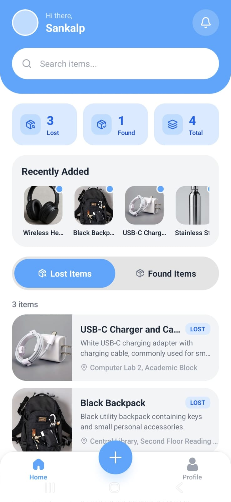
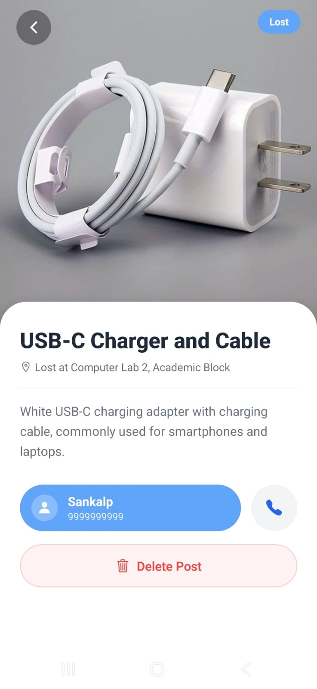
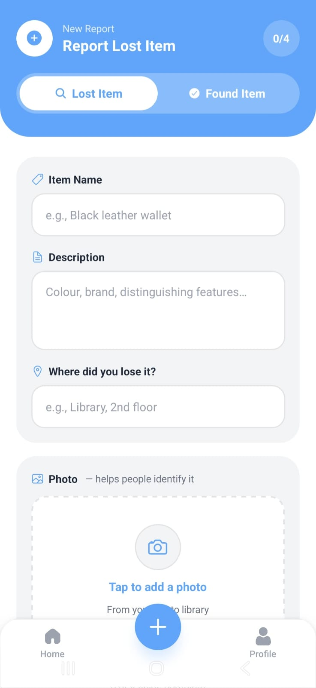
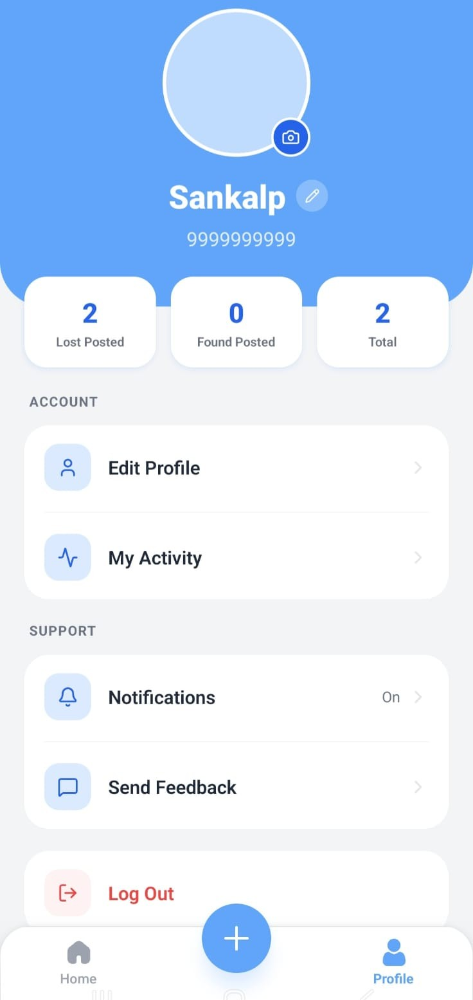

# MetaFinder 

A mobile app to help people **report, find, and reclaim lost items** within a community, campus, or organization. Post a "Lost" or "Found" item with a photo, location, and description connect with the right person to get it back.

Built with **React Native (Expo)** and **Firebase**.


---

## Screenshots

| Home Feed | Item Details | Post Item | Profile |
|---|---|---|---|
|  |  |  |  |

---

## Features

- **Post lost or found items** with photo, name, description, and location
- **Browse and filter** items by type (lost/found) and category
- **Location tagging** so people know where an item was lost or found
- **Direct contact** with the poster to arrange a return
- **Manage your own posts** owners can delete their listings
- **Real-time updates** powered by Firebase Firestore

### Under Development
- Tag-based categorization (electronics, documents, keys, pets, etc.)
- Auto-suggested matches between lost and found posts
- "Is this yours?" claim flow before sharing contact info
- Push notifications

---

## Tech Stack

- **Framework:** [Expo](https://expo.dev) (React Native) with file-based routing (`expo-router`)
- **Backend:** [Firebase](https://firebase.google.com/) (Firestore + Auth)
- **Language:** TypeScript
- **Icons:** `@expo/vector-icons`

---

## Getting Started

### Prerequisites
- [Node.js](https://nodejs.org/) (LTS recommended)
- npm or yarn
- A [Firebase project](https://console.firebase.google.com/) with Firestore and Authentication enabled
- [Expo Go](https://expo.dev/go) app on your phone (for quick testing) or Android Studio / Xcode for emulators

### 1. Clone the repo
```bash
git clone https://github.com/sankalpj47/MetaFinder.git
cd MetaFinder
```

### 2. Install dependencies
```bash
npm install
```

### 3. Set up Firebase

Create a `.env` file in the project root with your Firebase config values:

```env
EXPO_PUBLIC_FIREBASE_API_KEY=your_api_key
EXPO_PUBLIC_FIREBASE_AUTH_DOMAIN=your_project.firebaseapp.com
EXPO_PUBLIC_FIREBASE_PROJECT_ID=your_project_id
EXPO_PUBLIC_FIREBASE_STORAGE_BUCKET=your_project.appspot.com
EXPO_PUBLIC_FIREBASE_MESSAGING_SENDER_ID=your_sender_id
EXPO_PUBLIC_FIREBASE_APP_ID=your_app_id
```

> ⚠️ Add `.env` to your `.gitignore` so it's never committed to a public repo.

Then create a `firebase.ts` file in the project root that reads from these variables:

```ts
import { initializeApp } from "firebase/app"
import { getFirestore } from "firebase/firestore"
import { getAuth } from "firebase/auth"

const firebaseConfig = {
  apiKey: process.env.EXPO_PUBLIC_FIREBASE_API_KEY,
  authDomain: process.env.EXPO_PUBLIC_FIREBASE_AUTH_DOMAIN,
  projectId: process.env.EXPO_PUBLIC_FIREBASE_PROJECT_ID,
  storageBucket: process.env.EXPO_PUBLIC_FIREBASE_STORAGE_BUCKET,
  messagingSenderId: process.env.EXPO_PUBLIC_FIREBASE_MESSAGING_SENDER_ID,
  appId: process.env.EXPO_PUBLIC_FIREBASE_APP_ID,
}

const app = initializeApp(firebaseConfig)
export const db = getFirestore(app)
export const authi = getAuth(app)
```

If building for Android, also add your `google-services.json` file to the project root and reference it in `app.json`:

```json
{
  "expo": {
    "android": {
      "package": "com.yourcompany.metafinder",
      "googleServicesFile": "./google-services.json"
    }
  }
}
```

### 4. Start the app
```bash
npx expo start
```

In the output, you'll find options to open the app in:
- [Expo Go](https://expo.dev/go) — fastest way to try it on your own phone
- [Android emulator](https://docs.expo.dev/workflow/android-studio-emulator/)
- [iOS simulator](https://docs.expo.dev/workflow/ios-simulator/) (Mac only)
- A [development build](https://docs.expo.dev/develop/development-builds/introduction/)

---

## Building an APK

This project uses [EAS Build](https://docs.expo.dev/build/introduction/) to generate installable Android APKs.

```bash
npm install -g eas-cli
eas login
eas build:configure
eas build --platform android --profile preview
```

The build link (APK download) will appear in your terminal and on [expo.dev](https://expo.dev) once complete.

---

## Project Structure

```
metafinder/
├── app/                  # File-based routes (expo-router)
│   ├── (tabs)/           # Tab screens (home, post, profile, etc.)
│   └── item/[id].tsx     # Item details screen
├── assets/               # Images, fonts, screenshots
├── firebase.ts           # Firebase config & initialization
├── app.json              # Expo app configuration
└── package.json
```

---

##  Reset to a Blank Project

If you ever want to start fresh from the default Expo template:
```bash
npm run reset-project
```
This moves the current starter code into `app-example/` and creates a blank `app/` directory.

---

## Contributing

Contributions, issues, and feature requests are welcome. Feel free to open a pull request or file an issue.

---

## 🔗 Learn More

- [Expo documentation](https://docs.expo.dev/)
- [Expo Router docs](https://docs.expo.dev/router/introduction/)
- [Firebase docs](https://firebase.google.com/docs)
- [Expo community Discord](https://chat.expo.dev)
